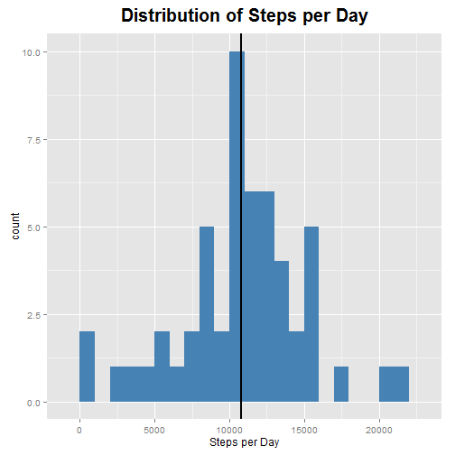
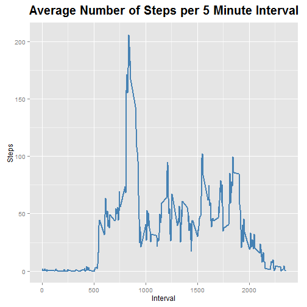
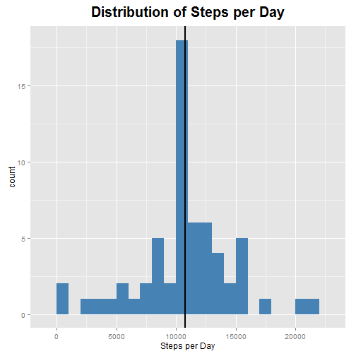
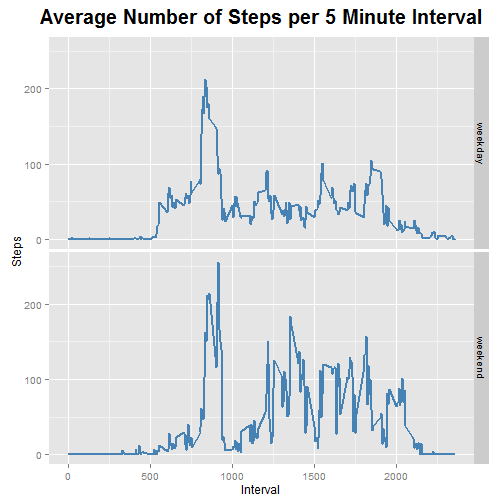

Peer Assessment 1
=================


Loading in the data and creating an identical dataset with ommitted missing values

```r
data <- read.csv("activity.csv", header = TRUE, sep = ",") 
cleandata <- data[!is.na(data),]
```

Aggregate total steps by data:

```r
steps_per_day <- aggregate(steps ~ date, data = cleandata, FUN = sum)
```

Calculates mean and median of the total number of steps taken per day

```r
stepsMean <- mean(steps_per_day$steps)
print(stepsMean)
```

```
## [1] 10766.19
```

```r
stepsMedian <- median(steps_per_day$steps)
print(stepsMedian)
```

```
## [1] 10765
```

Creates histogram of total steps taken per day

```r
library(ggplot2)

ggplot(data = steps_per_day, aes(x = steps_per_day$steps)) + geom_histogram(fill = "steelblue", binwidth = 1000) + 
    xlab("Steps per Day") + ggtitle("Distribution of Steps per Day") + geom_vline(xintercept = stepsMean, size = 1) +
    theme(plot.title = element_text(size = 20, face = "bold", vjust = 2))
```

 

Creates a time series plot of the average number of steps taken (averaged across all days) versus the 5-minute intervals

```r
steps_per_interval <- aggregate(steps ~ interval, data = cleandata, FUN = mean)

ggplot(data = steps_per_interval, aes(x = interval, y = steps)) + geom_line(color = "steelblue", size = 1) + 
    xlab("Interval") + ylab("Steps") + ggtitle("Average Number of Steps per 5 Minute Interval") +
    theme(plot.title = element_text(size = 20, face = "bold", vjust = 2))
```

 

Calculates which interval has, on average, the maximum number of steps

```r
maxSteps <- max(steps_per_interval$steps)
maxSteps_interval <- steps_per_interval$interval[which(steps_per_interval$steps == maxSteps)]
print(maxSteps_interval)
```

```
## [1] 835
```

Calculates and reports the total number of missing values in the dataset

```r
num_NA <- sum(is.na(data))
print(num_NA)
```

```
## [1] 2304
```

Replaces missing data with the step means of their respective intervals

```r
## replaces NA values with the means for that interval
data_filledNA <- data
for(i in 1:nrow(data_filledNA)){
    if (is.na(data_filledNA$steps[i])) {
        intervalIndex <- data_filledNA$interval[i]
        data_filledNA$steps[i] <- steps_per_interval$steps[steps_per_interval$interval == intervalIndex]
    }
}
```

Creates a histogram of the total number of steps taken each day with the Data_filledNA dataset

```r
steps_per_day_filledNA <- aggregate(steps ~ date, data = data_filledNA, FUN = sum)

ggplot(data = steps_per_day_filledNA, aes(x = steps_per_day_filledNA$steps)) + geom_histogram(fill = "steelblue", binwidth = 1000) + 
    xlab("Steps per Day") + ggtitle("Distribution of Steps per Day") + geom_vline(xintercept = mean(steps_per_day_filledNA$steps), size = 1) +
    theme(plot.title = element_text(size = 20, face = "bold", vjust = 2))
```

 

Creates a new factor variable in the dataset with "weekday" and "weekend" levels 

```r
data_filledNA$date <- as.Date(data_filledNA$date)

for(i in 1:nrow(data_filledNA)){
    if(weekdays(data_filledNA$date[i]) == "Saturday" | weekdays(data_filledNA$date[i]) == "Saturday") {
        data_filledNA$dayType[i] = "weekend"
    }
    else data_filledNA$dayType[i] = "weekday"
}
```

Creates a panel plot containing a time series plot of the 5-minute intercal and the average number of steps taken, averaged across all weekdays/weekends

```r
steps_per_interval_filledNA <- aggregate(steps ~ interval + dayType, data = data_filledNA, FUN = mean)
                                         
ggplot(data = steps_per_interval_filledNA, aes(x = interval, y = steps)) + 
    geom_line(color = "steelblue", size = 1) + 
    facet_grid(dayType ~ .) + 
    xlab("Interval") + ylab("Steps") + ggtitle("Average Number of Steps per 5 Minute Interval") +
    theme(plot.title = element_text(size = 20, face = "bold", vjust = 2))
```

 
